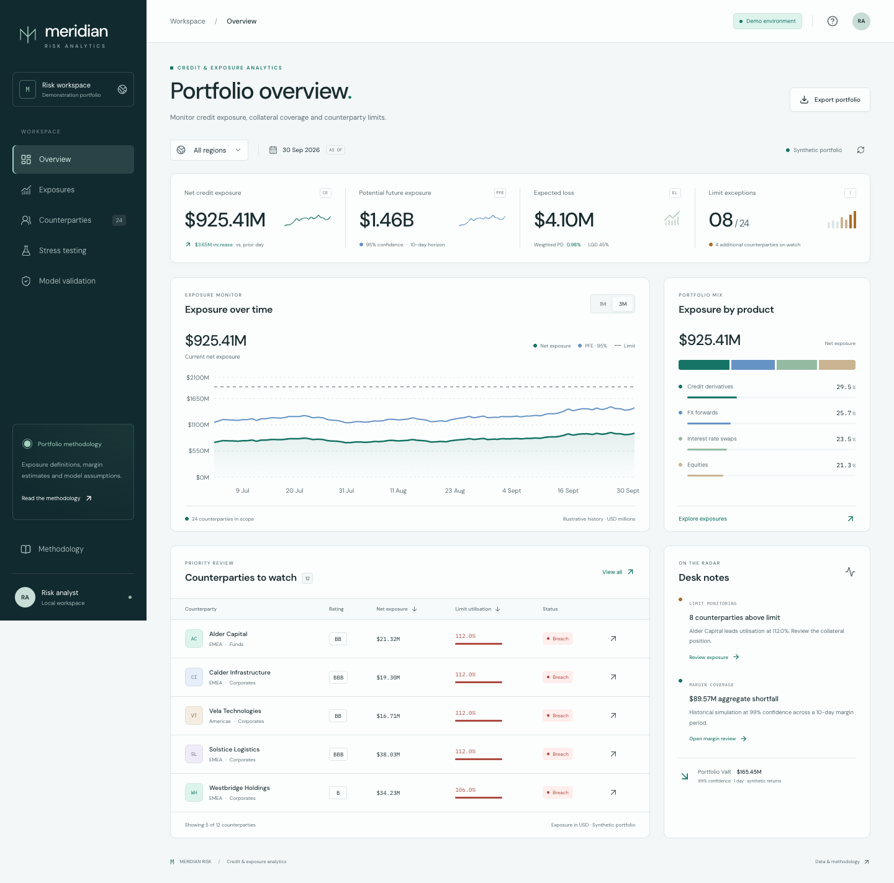

Meridian Risk
=============

Credit, exposure and model risk analytics. A Python risk service and a responsive
React dashboard for reviewing a synthetic counterparty portfolio.

The workbench brings together five workflows:

* **Portfolio overview:** current exposure, potential future exposure, expected
  loss, limit exceptions and product concentration.
* **Exposure and margin:** collateral coverage, an exposure bridge, historical
  margin estimates and margin shortfalls.
* **Counterparty review:** credit ratings, financial ratios, search, status
  filters and analyst notes saved in the browser.
* **Stress testing:** market stress, PD multipliers and collateral haircuts with
  recalculated exposure, expected loss, margin and limit breaches.
* **Model validation:** an OptBinning weight-of-evidence scorecard fitted to
  synthetic observations, with held-out ROC AUC, Gini, KS and bin diagnostics.

Project ownership
-----------------

Gopesh (`@CodeCrusherG <https://github.com/CodeCrusherG>`_) owns this project.

Ownership covers this application and its project-specific changes. Upstream
engine authorship and license notices are retained below.

Run locally
-----------

Requires Python 3.12+ and Node.js 22.12+ (Node 24 LTS recommended).
From this directory:

.. code-block:: bash

   uv sync --locked --extra dashboard
   npm ci --prefix dashboard
   make dev

Open http://127.0.0.1:5174. The API runs at http://127.0.0.1:8017 and its
interactive documentation is at http://127.0.0.1:8017/docs.
``make dev`` stops both processes when interrupted. It reports occupied ports
instead of stopping other applications.

Without ``uv``, create a virtual environment and run
``python -m pip install -e '.[dashboard]'``. Then use the same frontend commands.

For a single local server serving the production build:

.. code-block:: bash

   npm run build --prefix dashboard
   .venv/bin/python -m uvicorn meridian.api:app --host 127.0.0.1 --port 8017

Open http://127.0.0.1:8017. Build before starting the server. The generated
``dashboard/dist`` directory is required for this mode. Hash-based navigation
preserves deep links and browser history without server-side routing rules.

Tests
-----

.. code-block:: bash

   uv sync --locked --all-extras
   .venv/bin/python -m pytest -q
   .venv/bin/ruff check optbinning meridian tests
   npm run build --prefix dashboard
   npm exec --prefix dashboard -- playwright install chrome
   npm run test:e2e --prefix dashboard

The browser suite starts the API and dashboard if they are not running. It checks
filters, CSV exports, note persistence, stress recalculation, model diagnostics,
error recovery, keyboard focus and accessibility at 320, 768, 1280 and 1920 pixels.

If optional ``tdigest`` or ``ecos`` builds fail on macOS with an SDK linker error,
use a compatible installed Command Line Tools SDK for that command, for example
``SDKROOT=/Library/Developer/CommandLineTools/SDKs/MacOSX15.4.sdk uv sync --locked --all-extras``.
The dashboard itself does not require these optional extensions.

Data and methodology
--------------------

All counterparties, financial ratios, positions and returns are synthetic, with
fixed random seeds and a 30 September 2026 reporting date. The historical exposure
chart is an illustrative path anchored to the current calculated exposure, not a
reconstruction of historical positions. All monetary values use USD millions.

* Net exposure = max(gross positive exposure - haircut-adjusted collateral, 0).
* PFE = net exposure + a 95% normal-volatility add-on over ten business days.
* Expected loss = one-year rating PD x 45% LGD x current net exposure.
* Initial margin uses a 99% historical loss quantile scaled by the square root
  of ten. Portfolio VaR aggregates same-day returns before taking the quantile.
* The scorecard uses a stratified 70/30 train/test split. Bins and the logistic
  regression are fitted only on training data. PSI compares the two score
  distributions; it does not establish stability over time.

These are analytical prototypes, not SIMM, IFRS 9, regulatory capital or approved
risk models. Review notes stay in this browser; there is no shared persistence,
login system, market feed or bank affiliation. Ratings in the portfolio are
illustrative inputs and are not predictions from the separate scorecard demo.

See `role alignment and assumptions <docs/role-alignment.md>`_ for how the
workflows relate to the supplied job descriptions.

Implementation
--------------

``meridian/`` contains the FastAPI service, portfolio calculations and scorecard
validation. ``dashboard/`` contains React, TypeScript, Vite and Recharts. Fonts
are served locally. Python dependencies are locked in ``uv.lock``; frontend
dependencies are locked in ``dashboard/package-lock.json``.

The project distribution is named ``meridian-risk``. The project folder is named ``meridian-risk``; ``optbinning`` Python imports
remain compatible with the original engine.
The Apache 2.0 license and upstream authorship are retained. The original library
README is preserved in `docs/engine/upstream-readme.rst <docs/engine/upstream-readme.rst>`_.

OptBinning was created by Guillermo Navas-Palencia:
`upstream source <https://github.com/guillermo-navas-palencia/optbinning>`_ and
`engine documentation <https://gnpalencia.org/optbinning/>`_. The application
extends that library; it does not claim authorship of the underlying engine.
